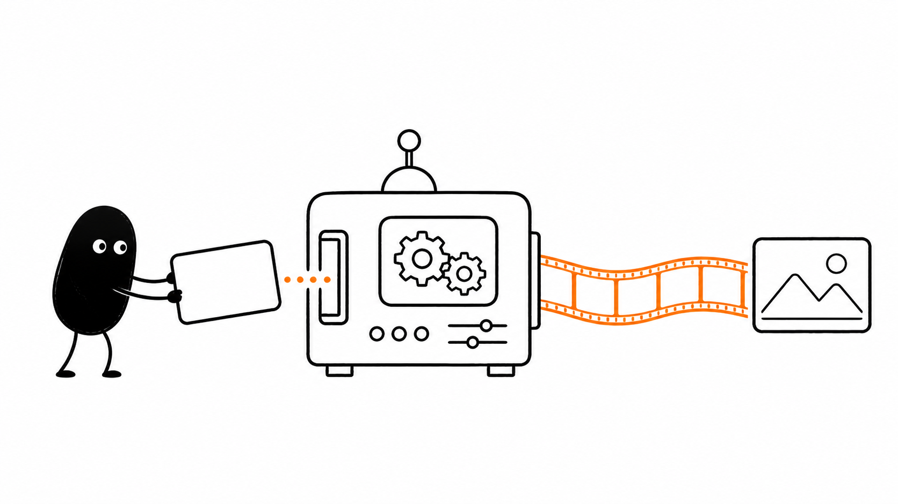

# 小黑配图静态转动态流程 Skill



把一张小黑静态配图，规划成稳定、可执行的动态视频素材：从口播筛选分镜，到首尾帧延展、即梦图生视频提示词，以及可复制的 HTML 分镜交付页。

## 适合什么

- 用小黑讲解抽象流程、状态变化和章节转场。
- 将单张配图做成 4–6 秒稳定微动效。
- 将连贯故事或商业转场拆成关键帧、16:9 时间线大板和 8–10 秒视频方案。
- 将图片和即梦 / Omni 提示词按口播时序整理成交付页。

## 安装

先安装原始静态配图 Skill：

```bash
git clone https://github.com/helloianneo/ian-xiaohei-illustrations.git
mkdir -p "${CODEX_HOME:-$HOME/.codex}/skills"
cp -R ./ian-xiaohei-illustrations/ian-xiaohei-illustrations "${CODEX_HOME:-$HOME/.codex}/skills/"
```

再安装本 Skill：

```bash
git clone https://github.com/adgaiiiiilllll-code/xiaohei-static-to-motion-flow.git
cp -R ./xiaohei-static-to-motion-flow/xiaohei-static-to-motion-flow "${CODEX_HOME:-$HOME/.codex}/skills/"
```

安装后，可直接这样使用：

```text
使用 $xiaohei-static-to-motion-flow，把这张小黑配图规划成固定机位、4–6 秒、可循环的即梦动态视频。
```

## 工作流

1. 用 `$ian-xiaohei-illustrations` 完成小黑静态配图或关键帧。
2. 用本 Skill 判断哪些口播值得做分镜，哪些应保留录屏或真人口播。
3. 为静帧预留首尾帧延展空间，写清可动元素与稳定元素。
4. 默认输出中文即梦提示词；用户需要时补充 Omni 版本。
5. 多分镜项目整理为“图片 + 时序 + 可复制提示词”的本地 HTML 页。

## 致敬与来源

小黑静态配图能力基于 Ian 的 [Ian Xiaohei Illustrations](https://github.com/helloianneo/ian-xiaohei-illustrations) 协同使用；本项目在其基础上扩展了静态配图转动态视频的分镜与提示词工作流。

- 作者：Ian（伊恩）
- 原项目：<https://github.com/helloianneo/ian-xiaohei-illustrations>
- 许可证：MIT License，Copyright (c) 2026 Ian

本项目不打包原项目的示例图或源码；使用前请按原项目说明单独安装。原项目要求衍生发布时保留 `Ian Xiaohei Illustrations` 名称或向 Ian 署名；完整说明见 [THIRD_PARTY_NOTICES.md](THIRD_PARTY_NOTICES.md)。

## 本项目增量

- 从教程口播筛选真正值得动画化的分镜。
- 静态图的首帧 / 尾帧与可延展空间规划。
- 即梦优先的中文图生视频提示词。
- 固定机位、禁止新增物体、物体稳定等教程微动效约束。
- 图片、时序与提示词并列的 HTML 交付方式。

## 许可

本仓库的原创增量采用 MIT License；原项目的版权与 NOTICE 保留在 [THIRD_PARTY_NOTICES.md](THIRD_PARTY_NOTICES.md)。
